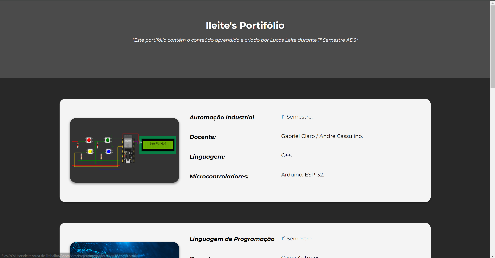

<h1 align="center">
  💻 Portfólio - Lucas Leite
</h1>

<h4 align="center"><a href="file:///C:/Users/leite/Area%20de%20Trabalho/Anota%C3%A7%C3%B5es/ProjetoIntegrador/homepage/index.html">Clique para visitar o projeto</a></h4>

## 📚 Seções

O site é composto por seis seções:

- **Home:** Nele temos um breve resumo do conteúdo;
- **Automação Industrial:** Nessa seção seguem exercícios criados em aula e para entrega, durante o 1º semestre 2024;
- **Linguagem de Programação:** Abordo o conteúdo passado durante o semestre, com explicações, imagens, e códigos criados por mim exemplificando o conteúdo;
- **Desenvolvimento Web:** Apresenta alguns projetos desenvolvidos e com link direto para os repositório com os códigos no GitHub;
- **Banco de Dados:** Exibe através de cards os diversos assuntos tratados em sala de aula, algumas imagens sendo exercicios propostos em aula;
- **Ciência de Dados:** Nele apresento o conteúdo que desenvolvemos em sala de aula, e ao final da página segue links do Colab para melhor visualização;

---

## 💼 Tecnologias utilizadas

Para o desenvolvimento deste site utilizei as seguintes tecnologias:

- HTML;
- CSS;
- JavaScript;

---

<h2>📖 Autor</h2>

<table>
  <tr>
    <td align="center">
      <a href="https://github.com/llei7e">
         
        
          <b>Lucas Leite</b>
        
      </a>
    </td>
  </tr>
</table>
